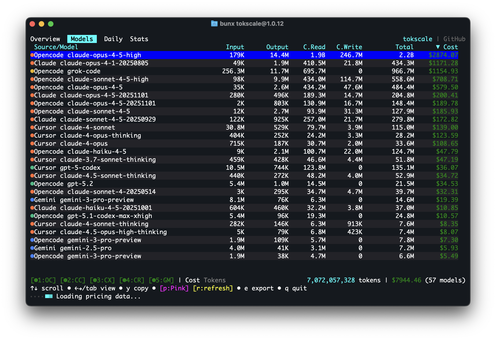
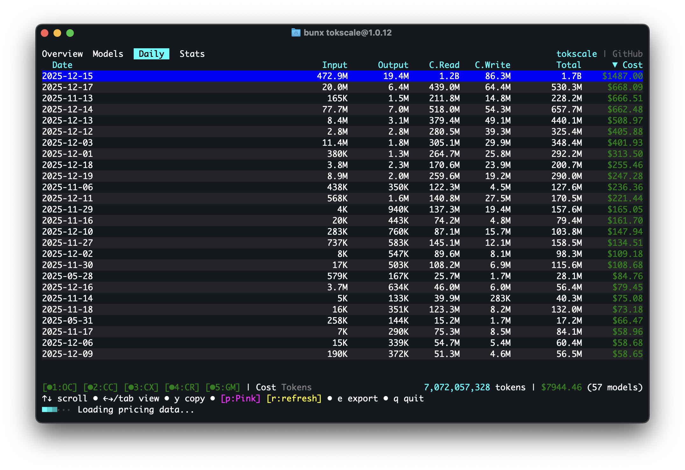
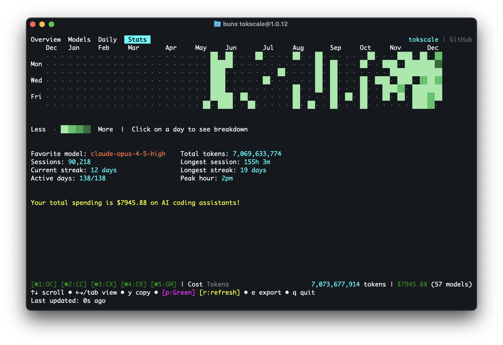
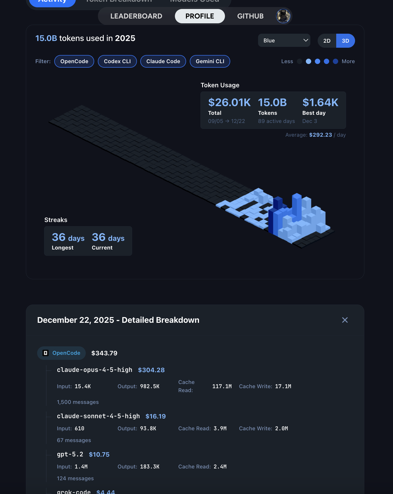
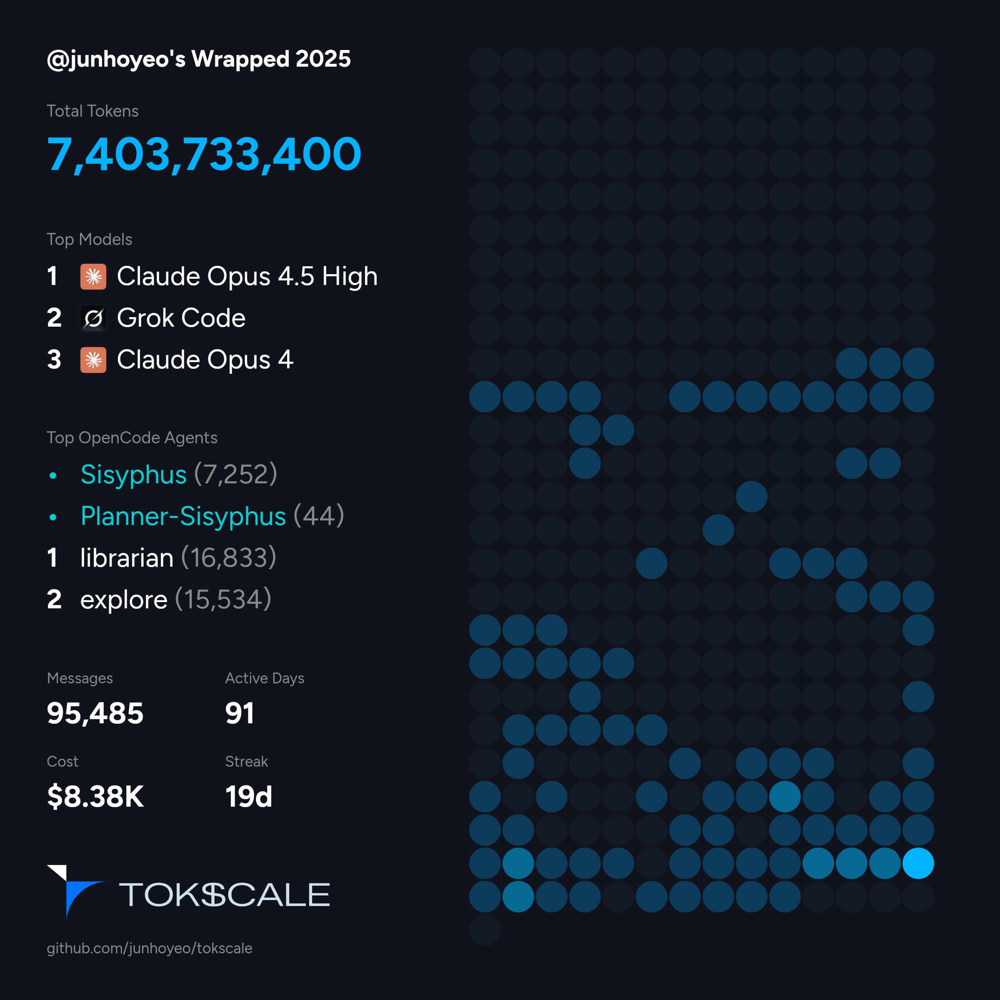
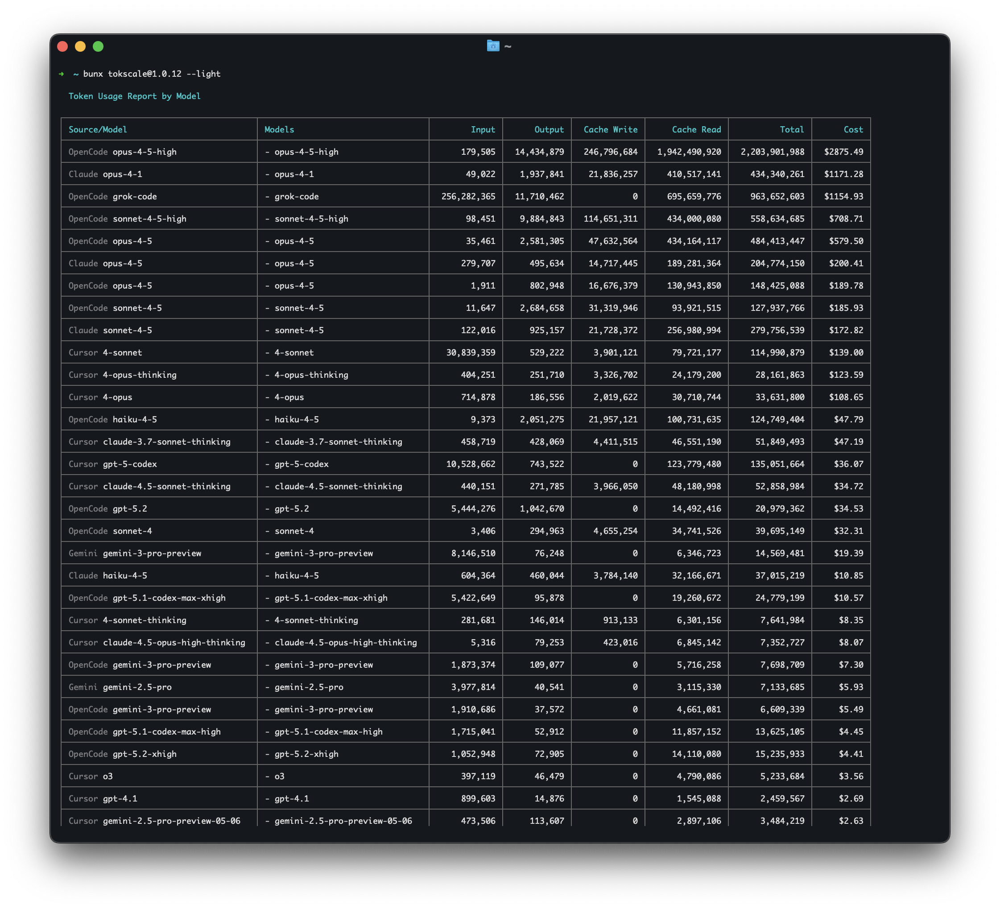
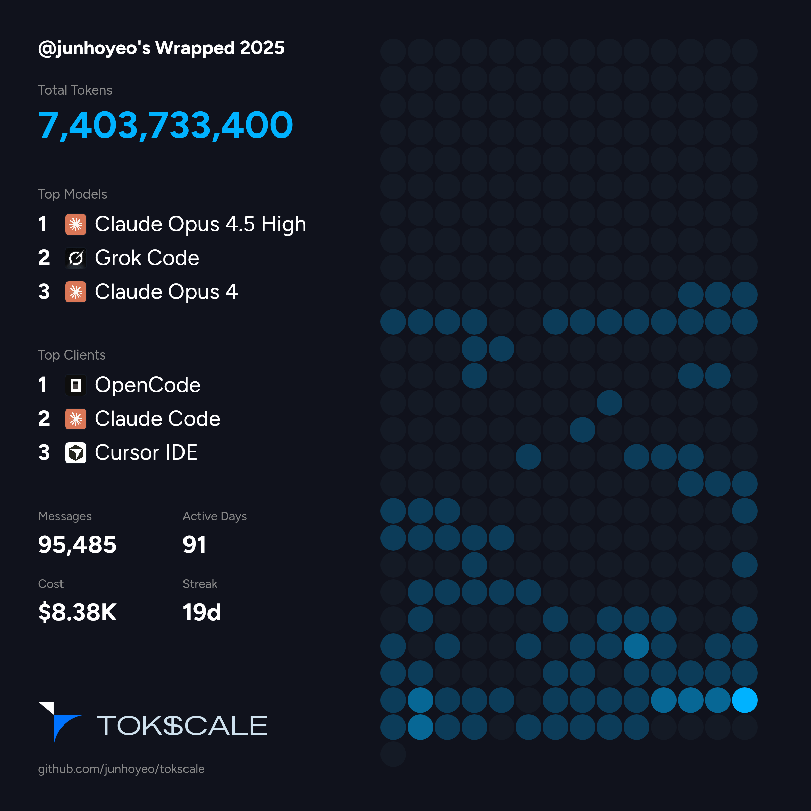
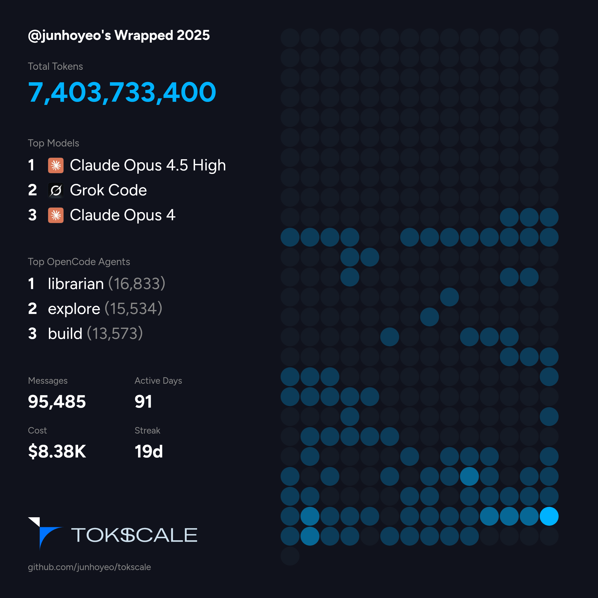

<!-- <CENTERED SECTION FOR GITHUB DISPLAY> -->

<div align="center">

[](https://tokscale.ai)

</div>

> A high-performance CLI tool and visualization dashboard for tracking AI coding assistant token usage and costs across multiple platforms.

<div align="center">

[](https://github.com/junhoyeo/tokscale/releases)
[](https://www.npmjs.com/package/tokscale)
[](https://github.com/junhoyeo/tokscale/graphs/contributors)
[](https://github.com/junhoyeo/tokscale/network/members)
[](https://github.com/junhoyeo/tokscale/stargazers)
[](https://github.com/junhoyeo/tokscale/issues)
[](https://github.com/junhoyeo/tokscale/blob/master/LICENSE)

[English](README.md) | [한국어](README.ko.md) | [日本語](README.ja.md) | [简体中文](README.zh-cn.md)

</div>

<!-- </CENTERED SECTION FOR GITHUB DISPLAY> -->

| Overview | Models |
|:---:|:---:|
|  |  | 

| Daily Summary | Stats |
|:---:|:---:|
|  |  | 

| Frontend (3D Contributions Graph) | Wrapped 2025 |
|:---:|:---:|
| <a href="https://tokscale.ai"></a> | <a href="#wrapped-2025"></a> |

> **Run [`bunx tokscale@latest submit`](#social) to submit your usage data to the leaderboard and create your public profile!**

## Contents

- [Overview](#overview)
  - [Why "Tokscale"?](#why-tokscale)
- [Features](#features)
- [Installation](#installation)
  - [Quick Start](#quick-start)
  - [Prerequisites](#prerequisites)
  - [Development Setup](#development-setup)
  - [Building the Native Module](#building-the-native-module)
- [Usage](#usage)
  - [Basic Commands](#basic-commands)
  - [TUI Features](#tui-features)
  - [Filtering by Platform](#filtering-by-platform)
  - [Date Filtering](#date-filtering)
  - [Pricing Lookup](#pricing-lookup)
  - [Social](#social)
  - [Cursor IDE Commands](#cursor-ide-commands)
  - [Environment Variables](#environment-variables)
- [Frontend Visualization](#frontend-visualization)
  - [Features](#features-1)
  - [Running the Frontend](#running-the-frontend)
- [Social Platform](#social-platform)
  - [Features](#features-2)
  - [Getting Started](#getting-started)
  - [Data Validation](#data-validation)
- [Wrapped 2025](#wrapped-2025)
- [Development](#development)
- [Supported Platforms](#supported-platforms)
- [Session Data Retention](#session-data-retention)
- [Data Sources](#data-sources)
- [Pricing](#pricing)
- [Contributing](#contributing)
- [Acknowledgments](#acknowledgments)
- [License](#license)

## Overview

**Tokscale** helps you monitor and analyze your token consumption from:

| Logo | Client | Data Location | Supported |
|------|----------|---------------|-----------|
|  | [OpenCode](https://github.com/sst/opencode) | `~/.local/share/opencode/storage/message/` | ✅ Yes |
|  | [Claude Code](https://docs.anthropic.com/en/docs/claude-code) | `~/.claude/projects/` | ✅ Yes |
|  | [Codex CLI](https://github.com/openai/codex) | `~/.codex/sessions/` | ✅ Yes |
|  | [Gemini CLI](https://github.com/google-gemini/gemini-cli) | `~/.gemini/tmp/*/chats/` | ✅ Yes |
|  | [Cursor IDE](https://cursor.com/) | API sync via `~/.config/tokscale/cursor-cache/` | ✅ Yes |
|  | [Amp (AmpCode)](https://ampcode.com/) | `~/.local/share/amp/threads/` | ✅ Yes / from `v1.0.18` (next release) |
|  | [Droid (Factory Droid)](https://factory.ai/) | `~/.factory/sessions/` | ✅ Yes / from `v1.0.18` (next release) |

Get real-time pricing calculations using [🚅 LiteLLM's pricing data](https://github.com/BerriAI/litellm), with support for tiered pricing models and cache token discounts.

### Why "Tokscale"?

This project is inspired by the **[Kardashev scale](https://en.wikipedia.org/wiki/Kardashev_scale)**, a method proposed by astrophysicist Nikolai Kardashev to measure a civilization's level of technological advancement based on its energy consumption. A Type I civilization harnesses all energy available on its planet, Type II captures the entire output of its star, and Type III commands the energy of an entire galaxy.

In the age of AI-assisted development, **tokens are the new energy**. They power our reasoning, fuel our productivity, and drive our creative output. Just as the Kardashev scale tracks energy consumption at cosmic scales, Tokscale measures your token consumption as you scale the ranks of AI-augmented development. Whether you're a casual user or burning through millions of tokens daily, Tokscale helps you visualize your journey up the scale—from planetary developer to galactic code architect.

## Features

- **Interactive TUI Mode** - Beautiful terminal UI powered by OpenTUI (default mode)
  - 4 interactive views: Overview, Models, Daily, Stats
  - Keyboard & mouse navigation
  - GitHub-style contribution graph with 9 color themes
  - Real-time filtering and sorting
  - Zero flicker rendering (native Zig engine)
- **Multi-platform support** - Track usage across OpenCode, Claude Code, Codex CLI, Cursor IDE, Gemini CLI, and Amp
- **Real-time pricing** - Fetches current pricing from LiteLLM with 1-hour disk cache; automatic OpenRouter fallback for new models
- **Detailed breakdowns** - Input, output, cache read/write, and reasoning token tracking
- **Native Rust core** - All parsing and aggregation done in Rust for 10x faster processing
- **Web visualization** - Interactive contribution graph with 2D and 3D views
- **Flexible filtering** - Filter by platform, date range, or year
- **Export to JSON** - Generate data for external visualization tools
- **Social Platform** - Share your usage, compete on leaderboards, and view public profiles

## Installation

### Quick Start

```bash
# Install Bun (if not already installed)
curl -fsSL https://bun.sh/install | bash

# Run directly with bunx
bunx tokscale@latest

# Light mode (no OpenTUI, just table rendering)
bunx tokscale@latest --light
```

That's it! This gives you the full interactive TUI experience with zero setup.

> **Requires [Bun](https://bun.sh/)**: The interactive TUI uses OpenTUI's native Zig modules for zero-flicker rendering, which requires the Bun runtime.

> **Package Structure**: `tokscale` is an alias package (like [`swc`](https://www.npmjs.com/package/swc)) that installs `@tokscale/cli`. Both install the same CLI with the native Rust core (`@tokscale/core`) included.


### Prerequisites

- [Bun](https://bun.sh/) (required)
- (Optional) Rust toolchain for building native module from source

### Development Setup

For local development or building from source:

```bash
# Clone the repository
git clone https://github.com/junhoyeo/tokscale.git
cd tokscale

# Install Bun (if not already installed)
curl -fsSL https://bun.sh/install | bash

# Install dependencies
bun install

# Run the CLI in development mode
bun run cli
```

> **Note**: `bun run cli` is for local development. When installed via `bunx tokscale`, the command runs directly. The Usage section below shows the installed binary commands.

### Building the Native Module

The native Rust module is **required** for CLI operation. It provides ~10x faster processing through parallel file scanning and SIMD JSON parsing:

```bash
# Build the native core (run from repository root)
bun run build:core
```

> **Note**: Native binaries are pre-built and included when you install via `bunx tokscale@latest`. Building from source is only needed for local development.

## Usage

### Basic Commands

```bash
# Launch interactive TUI (default)
tokscale

# Launch TUI with specific tab
tokscale models    # Models tab
tokscale monthly   # Daily view (shows daily breakdown)

# Use legacy CLI table output
tokscale --light
tokscale models --light

# Launch TUI explicitly
tokscale tui

# Export contribution graph data as JSON
tokscale graph --output data.json

# Output data as JSON (for scripting/automation)
tokscale --json                    # Default models view as JSON
tokscale models --json             # Models breakdown as JSON
tokscale monthly --json            # Monthly breakdown as JSON
tokscale models --json > report.json   # Save to file
```

### TUI Features

The interactive TUI mode provides:

- **4 Views**: Overview (chart + top models), Models, Daily, Stats (contribution graph)
- **Keyboard Navigation**:
  - `1-4` or `←/→/Tab`: Switch views
  - `↑/↓`: Navigate lists
  - `c/n/t`: Sort by cost/name/tokens
  - `1-6`: Toggle sources (OpenCode/Claude/Codex/Cursor/Gemini/Amp)
  - `p`: Cycle through 9 color themes
  - `r`: Refresh data
  - `e`: Export to JSON
  - `q`: Quit
- **Mouse Support**: Click tabs, buttons, and filters
- **Themes**: Green, Halloween, Teal, Blue, Pink, Purple, Orange, Monochrome, YlGnBu
- **Settings Persistence**: Preferences saved to `~/.config/tokscale/settings.json` (see [Configuration](#configuration))

### Filtering by Platform

```bash
# Show only OpenCode usage
tokscale --opencode

# Show only Claude Code usage
tokscale --claude

# Show only Codex CLI usage
tokscale --codex

# Show only Gemini CLI usage
tokscale --gemini

# Show only Cursor IDE usage (requires `tokscale cursor login` first)
tokscale --cursor

# Combine filters
tokscale --opencode --claude
```

### Date Filtering

Date filters work across all commands that generate reports (`tokscale`, `tokscale models`, `tokscale monthly`, `tokscale graph`):

```bash
# Quick date shortcuts
tokscale --today              # Today only
tokscale --week               # Last 7 days
tokscale --month              # Current calendar month

# Custom date range (inclusive, local timezone)
tokscale --since 2024-01-01 --until 2024-12-31

# Filter by year
tokscale --year 2024

# Combine with other options
tokscale models --week --claude --json
tokscale monthly --month --benchmark
```

> **Note**: Date filters use your local timezone. Both `--since` and `--until` are inclusive.

### Pricing Lookup

Look up real-time pricing for any model:

```bash
# Look up model pricing
tokscale pricing "claude-3-5-sonnet-20241022"
tokscale pricing "gpt-4o"
tokscale pricing "grok-code"

# Force specific provider source
tokscale pricing "grok-code" --provider openrouter
tokscale pricing "claude-3-5-sonnet" --provider litellm
```

**Lookup Strategy:**

The pricing lookup uses a multi-step resolution strategy:

1. **Exact Match** - Direct lookup in LiteLLM/OpenRouter databases
2. **Alias Resolution** - Resolves friendly names (e.g., `big-pickle` → `glm-4.7`)
3. **Tier Suffix Stripping** - Removes quality tiers (`gpt-5.2-xhigh` → `gpt-5.2`)
4. **Version Normalization** - Handles version formats (`claude-3-5-sonnet` ↔ `claude-3.5-sonnet`)
5. **Provider Prefix Matching** - Tries common prefixes (`anthropic/`, `openai/`, etc.)
6. **Fuzzy Matching** - Word-boundary matching for partial model names

**Provider Preference:**

When multiple matches exist, original model creators are preferred over resellers:

| Preferred (Original) | Deprioritized (Reseller) |
|---------------------|-------------------------|
| `xai/` (Grok) | `azure_ai/` |
| `anthropic/` (Claude) | `bedrock/` |
| `openai/` (GPT) | `vertex_ai/` |
| `google/` (Gemini) | `together_ai/` |
| `meta-llama/` | `fireworks_ai/` |

Example: `grok-code` matches `xai/grok-code-fast-1` ($0.20/$1.50) instead of `azure_ai/grok-code-fast-1` ($3.50/$17.50).

### Social

```bash
# Login to Tokscale (opens browser for GitHub auth)
tokscale login

# Check who you're logged in as
tokscale whoami

# Submit your usage data to the leaderboard
tokscale submit

# Submit with filters
tokscale submit --opencode --claude --since 2024-01-01

# Preview what would be submitted (dry run)
tokscale submit --dry-run

# Logout
tokscale logout
```


### Cursor IDE Commands

Cursor IDE requires separate authentication via session token (different from the social platform login):

```bash
# Login to Cursor (requires session token from browser)
tokscale cursor login

# Check Cursor authentication status and session validity
tokscale cursor status

# Logout from Cursor (removes saved credentials)
tokscale cursor logout
```

**Credentials storage**: Cursor session token is saved to `~/.config/tokscale/cursor-credentials.json`. Usage data is cached at `~/.config/tokscale/cursor-cache/`.

**To get your Cursor session token:**
1. Open https://www.cursor.com/settings in your browser
2. Open Developer Tools (F12)
3. **Option A - Network tab**: Make any action on the page, find a request to `cursor.com/api/*`, look in the Request Headers for the `Cookie` header, and copy only the value after `WorkosCursorSessionToken=`
4. **Option B - Application tab**: Go to Application → Cookies → `https://www.cursor.com`, find the `WorkosCursorSessionToken` cookie, and copy its value (not the cookie name)

> ⚠️ **Security Warning**: Treat your session token like a password. Never share it publicly or commit it to version control. The token grants full access to your Cursor account.

### Example Output (`--light` version)



### Configuration

Tokscale stores settings in `~/.config/tokscale/settings.json`:

```json
{
  "colorPalette": "blue",
  "includeUnusedModels": false
}
```

| Setting | Type | Default | Description |
|---------|------|---------|-------------|
| `colorPalette` | string | `"blue"` | TUI color theme (green, halloween, teal, blue, pink, purple, orange, monochrome, ylgnbu) |
| `includeUnusedModels` | boolean | `false` | Show models with zero tokens in reports |
| `autoRefreshEnabled` | boolean | `false` | Enable auto-refresh in TUI |
| `autoRefreshMs` | number | `60000` | Auto-refresh interval (30000-3600000ms) |

### Environment Variables

For advanced users with large datasets or specific requirements:

| Variable | Default | Description |
|----------|---------|-------------|
| `TOKSCALE_NATIVE_TIMEOUT_MS` | `300000` (5 min) | Maximum time for native subprocess processing |
| `TOKSCALE_MAX_OUTPUT_BYTES` | `52428800` (50MB) | Maximum output size from native subprocess |

```bash
# Example: Increase timeout for very large datasets
TOKSCALE_NATIVE_TIMEOUT_MS=600000 tokscale graph --output data.json

# Example: Increase output limit for power users with years of data
TOKSCALE_MAX_OUTPUT_BYTES=104857600 tokscale --json > report.json
```

> **Note**: These limits are safety measures to prevent hangs and memory issues. Most users won't need to change them.

## Frontend Visualization

The frontend provides a GitHub-style contribution graph visualization:

### Features

- **2D View**: Classic GitHub contribution calendar
- **3D View**: Isometric 3D contribution graph with height based on token usage
- **Multiple color palettes**: GitHub, GitLab, Halloween, Winter, and more
- **3-way theme toggle**: Light / Dark / System (follows OS preference)
- **GitHub Primer design**: Uses GitHub's official color system
- **Interactive tooltips**: Hover for detailed daily breakdowns
- **Day breakdown panel**: Click to see per-source and per-model details
- **Year filtering**: Navigate between years
- **Source filtering**: Filter by platform (OpenCode, Claude, Codex, Cursor, Gemini, Amp)
- **Stats panel**: Total cost, tokens, active days, streaks
- **FOUC prevention**: Theme applied before React hydrates (no flash)

### Running the Frontend

```bash
cd packages/frontend
bun install
bun run dev
```

Open [http://localhost:3000](http://localhost:3000) to access the social platform.

## Social Platform

Tokscale includes a social platform where you can share your usage data and compete with other developers.

### Features

- **Leaderboard** - See who's using the most tokens across all platforms
- **User Profiles** - Public profiles with contribution graphs and statistics
- **Period Filtering** - View stats for all time, this month, or this week
- **GitHub Integration** - Login with your GitHub account
- **Local Viewer** - View your data privately without submitting

### Getting Started

1. **Login** - Run `tokscale login` to authenticate via GitHub
2. **Submit** - Run `tokscale submit` to upload your usage data
3. **View** - Visit the web platform to see your profile and the leaderboard

### Data Validation

Submitted data goes through Level 1 validation:
- Mathematical consistency (totals match, no negatives)
- No future dates
- Required fields present
- Duplicate detection

## Wrapped 2025


Generate a beautiful year-in-review image summarizing your AI coding assistant usage—inspired by Spotify Wrapped.

| `bunx tokscale@latest wrapped` | `bunx tokscale@latest wrapped --clients` | `bunx tokscale@latest wrapped --agents --disable-pinned` |
|:---:|:---:|:---:|
|  |  |  |

### Command

```bash
# Generate wrapped image for current year
tokscale wrapped

# Generate for a specific year
tokscale wrapped --year 2025
```

### What's Included

The generated image includes:

- **Total Tokens** - Your total token consumption for the year
- **Top Models** - Your 3 most-used AI models ranked by cost
- **Top Clients** - Your 3 most-used platforms (OpenCode, Claude Code, Cursor, etc.)
- **Messages** - Total number of AI interactions
- **Active Days** - Days with at least one AI interaction
- **Cost** - Estimated total cost based on LiteLLM pricing
- **Streak** - Your longest consecutive streak of active days
- **Contribution Graph** - A visual heatmap of your yearly activity

The generated PNG is optimized for sharing on social media. Share your coding journey with the community!

## Development

> **Quick setup**: If you just want to get started quickly, see [Development Setup](#development-setup) in the Installation section above.

### Prerequisites

```bash
# Bun (required)
bun --version

# Rust (for native module)
rustc --version
cargo --version
```

### How to Run

After following the [Development Setup](#development-setup), you can:

```bash
# Build native module (optional but recommended)
bun run build:core

# Run in development mode (launches TUI)
cd packages/cli && bun src/cli.ts

# Or use legacy CLI mode
cd packages/cli && bun src/cli.ts --light
```

<details>
<summary>Advanced Development</summary>

### Project Scripts

| Script | Description |
|--------|-------------|
| `bun run cli` | Run CLI in development mode (TUI with Bun) |
| `bun run build:core` | Build native Rust module (release) |
| `bun run build:cli` | Build CLI TypeScript to dist/ |
| `bun run build` | Build both core and CLI |
| `bun run dev:frontend` | Run frontend development server |

**Package-specific scripts** (from within package directories):
- `packages/cli`: `bun run dev`, `bun run tui`
- `packages/core`: `bun run build:debug`, `bun run test`, `bun run bench`

**Note**: This project uses **Bun** as the package manager and runtime. TUI requires Bun due to OpenTUI's native modules.

### Testing

```bash
# Test native module (Rust)
cd packages/core
bun run test:rust      # Cargo tests
bun run test           # Node.js integration tests
bun run test:all       # Both
```

### Native Module Development

```bash
cd packages/core

# Build in debug mode (faster compilation)
bun run build:debug

# Build in release mode (optimized)
bun run build

# Run Rust benchmarks
bun run bench
```

### Graph Command Options

```bash
# Export graph data to file
tokscale graph --output usage-data.json

# Date filtering (all shortcuts work)
tokscale graph --today
tokscale graph --week
tokscale graph --since 2024-01-01 --until 2024-12-31
tokscale graph --year 2024

# Filter by platform
tokscale graph --opencode --claude

# Show processing time benchmark
tokscale graph --output data.json --benchmark
```

### Benchmark Flag

Show processing time for performance analysis:

```bash
tokscale --benchmark           # Show processing time with default view
tokscale models --benchmark    # Benchmark models report
tokscale monthly --benchmark   # Benchmark monthly report
tokscale graph --benchmark     # Benchmark graph generation
```

### Generating Data for Frontend

```bash
# Export data for visualization
tokscale graph --output packages/frontend/public/my-data.json
```

### Performance

The native Rust module provides significant performance improvements:

| Operation | TypeScript | Rust Native | Speedup |
|-----------|------------|-------------|---------|
| File Discovery | ~500ms | ~50ms | **10x** |
| JSON Parsing | ~800ms | ~100ms | **8x** |
| Aggregation | ~200ms | ~25ms | **8x** |
| **Total** | **~1.5s** | **~175ms** | **~8.5x** |

*Benchmarks for ~1000 session files, 100k messages*

#### Memory Optimization

The native module also provides ~45% memory reduction through:

- Streaming JSON parsing (no full file buffering)
- Zero-copy string handling
- Efficient parallel aggregation with map-reduce

#### Running Benchmarks

```bash
# Generate synthetic data
cd packages/benchmarks && bun run generate

# Run Rust benchmarks
cd packages/core && bun run bench
```

</details>

## Supported Platforms

### Native Module Targets

| Platform | Architecture | Status |
|----------|--------------|--------|
| macOS | x86_64 | Supported |
| macOS | aarch64 (Apple Silicon) | Supported |
| Linux | x86_64 (glibc) | Supported |
| Linux | aarch64 (glibc) | Supported |
| Linux | x86_64 (musl) | Supported |
| Linux | aarch64 (musl) | Supported |
| Windows | x86_64 | Supported |
| Windows | aarch64 | Supported |

## Session Data Retention

By default, some AI coding assistants automatically delete old session files. To preserve your usage history for accurate tracking, disable or extend the cleanup period.

| Platform | Default | Config File | Setting to Disable | Source |
|----------|---------|-------------|-------------------|--------|
| Claude Code | **⚠️ 30 days** | `~/.claude/settings.json` | `"cleanupPeriodDays": 9999999999` | [Docs](https://docs.anthropic.com/en/docs/claude-code/settings) |
| Gemini CLI | Disabled | `~/.gemini/settings.json` | `"sessionRetention.enabled": false` | [Docs](https://github.com/google-gemini/gemini-cli/blob/main/docs/cli/session-management.md) |
| Codex CLI | Disabled | N/A | No cleanup feature | [#6015](https://github.com/openai/codex/issues/6015) |
| OpenCode | Disabled | N/A | No cleanup feature | [#4980](https://github.com/sst/opencode/issues/4980) |

### Claude Code

**Default**: 30 days cleanup period

Add to `~/.claude/settings.json`:
```json
{
  "cleanupPeriodDays": 9999999999
}
```

> Setting an extremely large value (e.g., `9999999999` days ≈ 27 million years) effectively disables cleanup.

### Gemini CLI

**Default**: Cleanup disabled (sessions persist forever)

If you've enabled cleanup and want to disable it, remove or set `enabled: false` in `~/.gemini/settings.json`:
```json
{
  "general": {
    "sessionRetention": {
      "enabled": false
    }
  }
}
```

Or set an extremely long retention period:
```json
{
  "general": {
    "sessionRetention": {
      "enabled": true,
      "maxAge": "9999999d"
    }
  }
}
```

### Codex CLI

**Default**: No automatic cleanup (sessions persist forever)

Codex CLI does not have built-in session cleanup. Sessions in `~/.codex/sessions/` persist indefinitely.

> **Note**: There's an open feature request for this: [#6015](https://github.com/openai/codex/issues/6015)

### OpenCode

**Default**: No automatic cleanup (sessions persist forever)

OpenCode does not have built-in session cleanup. Sessions in `~/.local/share/opencode/storage/` persist indefinitely.

> **Note**: See [#4980](https://github.com/sst/opencode/issues/4980)

---

## Data Sources

### OpenCode

Location: `~/.local/share/opencode/storage/message/{sessionId}/*.json`

Each message file contains:
```json
{
  "id": "msg_xxx",
  "role": "assistant",
  "modelID": "claude-sonnet-4-20250514",
  "providerID": "anthropic",
  "tokens": {
    "input": 1234,
    "output": 567,
    "reasoning": 0,
    "cache": { "read": 890, "write": 123 }
  },
  "time": { "created": 1699999999999 }
}
```

### Claude Code

Location: `~/.claude/projects/{projectPath}/*.jsonl`

JSONL format with assistant messages containing usage data:
```json
{"type": "assistant", "message": {"model": "claude-sonnet-4-20250514", "usage": {"input_tokens": 1234, "output_tokens": 567, "cache_read_input_tokens": 890}}, "timestamp": "2024-01-01T00:00:00Z"}
```

### Codex CLI

Location: `~/.codex/sessions/*.jsonl`

Event-based format with `token_count` events:
```json
{"type": "event_msg", "payload": {"type": "token_count", "info": {"last_token_usage": {"input_tokens": 1234, "output_tokens": 567}}}}
```

### Gemini CLI

Location: `~/.gemini/tmp/{projectHash}/chats/session-*.json`

Session files containing message arrays:
```json
{
  "sessionId": "xxx",
  "messages": [
    {"type": "gemini", "model": "gemini-2.5-pro", "tokens": {"input": 1234, "output": 567, "cached": 890, "thoughts": 123}}
  ]
}
```

### Cursor IDE

Location: `~/.config/tokscale/cursor-cache/` (synced via Cursor API)

Cursor data is fetched from the Cursor API using your session token and cached locally. Run `tokscale cursor login` to authenticate. See [Cursor IDE Commands](#cursor-ide-commands) for setup instructions.

## Pricing

Tokscale fetches real-time pricing from [LiteLLM's pricing database](https://github.com/BerriAI/litellm/blob/main/model_prices_and_context_window.json).

**Dynamic Fallback**: For models not yet available in LiteLLM (e.g., recently released models), Tokscale automatically fetches pricing from [OpenRouter's endpoints API](https://openrouter.ai/docs/api/api-reference/endpoints/list-endpoints). This ensures you get accurate pricing from the model's author provider (e.g., Z.AI for glm-4.7) without waiting for LiteLLM updates.

**Caching**: Pricing data is cached to disk with 1-hour TTL for fast startup:
- LiteLLM cache: `~/.cache/tokscale/pricing-litellm.json`
- OpenRouter cache: `~/.cache/tokscale/pricing-openrouter.json` (incremental, caches only models you've used)

Pricing includes:
- Input tokens
- Output tokens
- Cache read tokens (discounted)
- Cache write tokens
- Reasoning tokens (for models like o1)
- Tiered pricing (above 200k tokens)

## Contributing

Contributions are welcome! Please follow these steps:

1. Fork the repository
2. Create a feature branch (`git checkout -b feature/amazing-feature`)
3. Make your changes
4. Run tests (`cd packages/core && bun run test:all`)
5. Commit your changes (`git commit -m 'Add amazing feature'`)
6. Push to the branch (`git push origin feature/amazing-feature`)
7. Open a Pull Request

### Development Guidelines

- Follow existing code style
- Add tests for new functionality
- Update documentation as needed
- Keep commits focused and atomic

## Acknowledgments

- [ccusage](https://github.com/ryoppippi/ccusage), [viberank](https://github.com/sculptdotfun/viberank), and [Isometric Contributions](https://github.com/jasonlong/isometric-contributions) for inspiration
- [OpenTUI](https://github.com/sst/opentui) for zero-flicker terminal UI framework
- [Solid.js](https://www.solidjs.com/) for reactive rendering
- [LiteLLM](https://github.com/BerriAI/litellm) for pricing data
- [napi-rs](https://napi.rs/) for Rust/Node.js bindings
- [github-contributions-canvas](https://github.com/sallar/github-contributions-canvas) for 2D graph reference

## License

<p align="center">
  <a href="https://github.com/junhoyeo">
    
  </a>
</p>

<p align="center">
  <strong>MIT © <a href="https://github.com/junhoyeo">Junho Yeo</a></strong>
</p>

If you find this project intriguing, **please consider starring it ⭐** or [follow me on GitHub](https://github.com/junhoyeo) and join the ride (1.1k+ already aboard). I code around the clock and ship mind-blowing things on a regular basis—your support won't go to waste.
